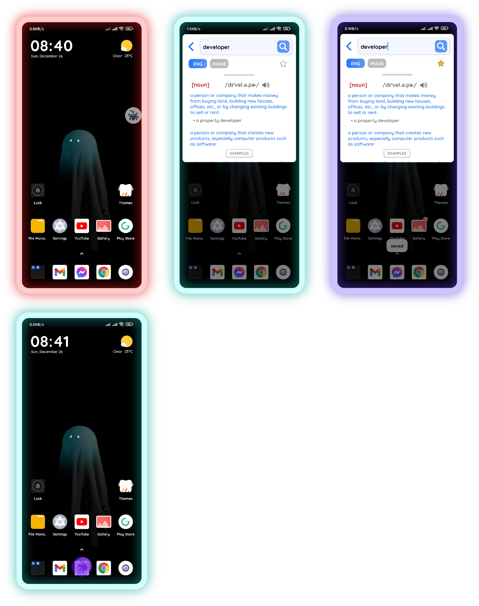
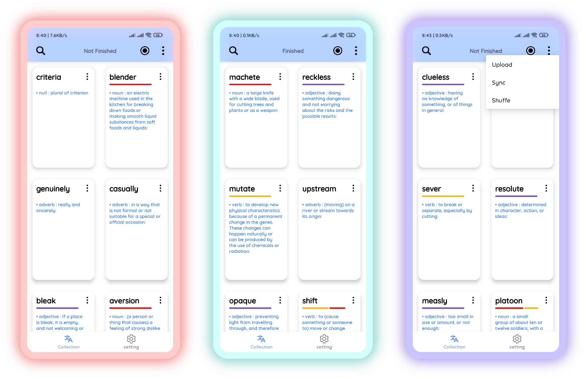
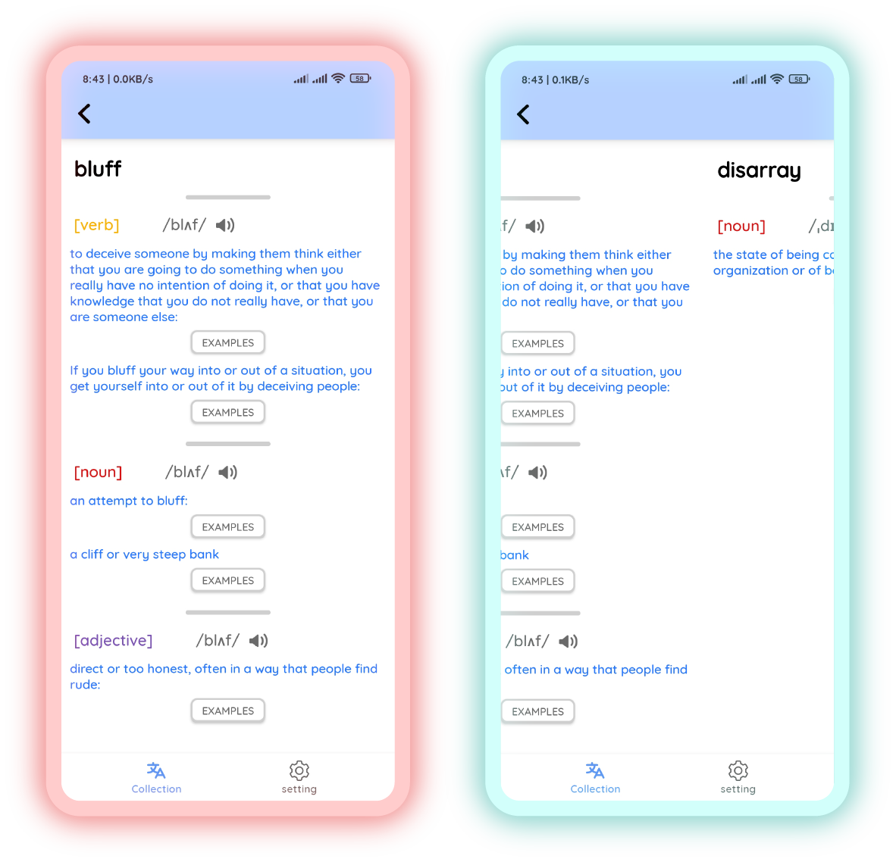

# Transe

## Developer

> this

### Content

I. Features

- Quick Translation via Floating window
- Login using Google Account
- Notify random vocabulary
- Study with your large collection of Vocabulary

II. Technologies

- Kotlin coroutines
- Firebase DB | Room DB
- Android Jetpack
- Dagger Hilt
- Lifecycle/Activity Components library
- Moshi + Retrofit library
- Lottie library
- Jsoup Library

III. Time Consuming

- Jun - Aug 2021

IV. Screenshots

- floating bubble    
  

- home screen    
  

- vocab details    
  
