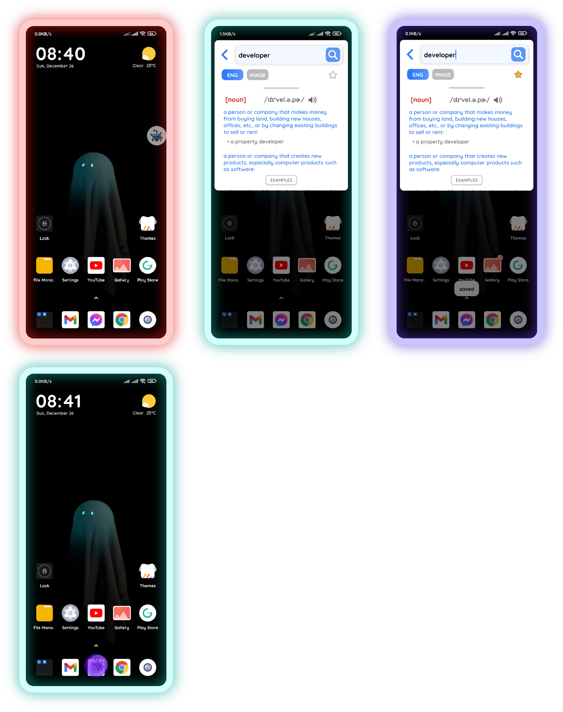
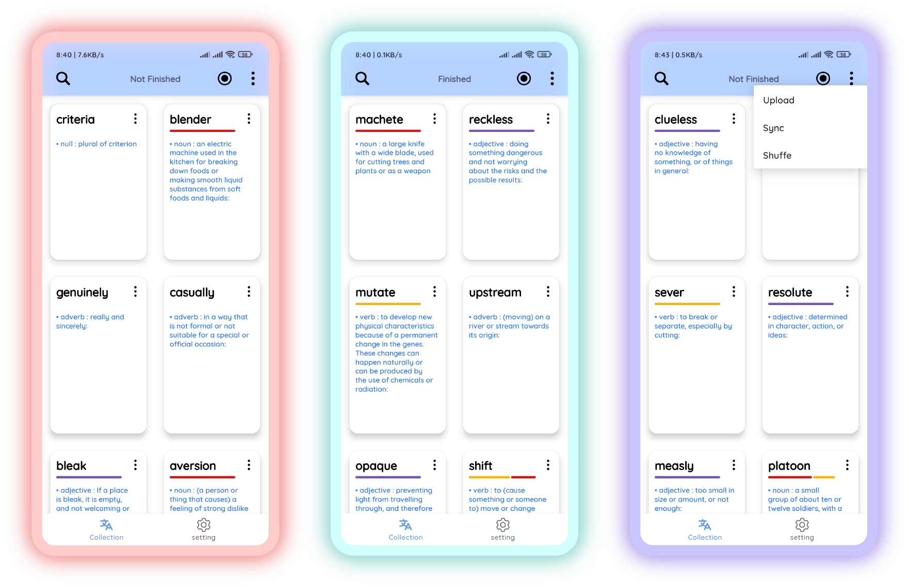

## Note
### <b> this project only show the main module, sorry for the inconvenience! <b>
 
  
## Content

I. What this app is used for?
  - Quickly search the definitions of word
  - Helping you learn new vocabularies easier
  - Syncing between android devices using Google Account, so that your large collection of vocabularies won't be loss ^^

II. Technologies
  - Kotlin coroutines
  - Firebase DB | Room DB (SQLite)
  - Android Jetpack
  - Dagger Hilt
  - Lifecycle/Activity Components
  - Retrofit for calling api
  - Lottie library
  - Jsoup Library

III. Time Consuming
  - Jun - Aug 2021

IV. Demo

https://user-images.githubusercontent.com/85553681/151544511-274e40ce-8583-4e15-95f2-7c369fba8467.mp4

  
- floating bubble    
  

- home screen    
  

- vocab details    
  
